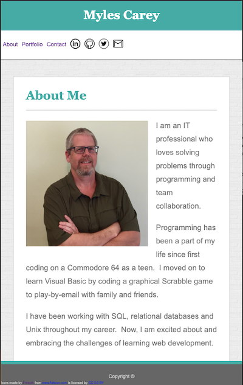

# Portfolio - Responsive Design

Personal Project Portfolio

## Description
 
This is a Portfolio with a landing About Me page, a Portfolio page and a contact page.

It utilizes HTML, CSS and Media quieries for responsive design.  The Portfolio page will be updated as each new project is completed.

## Deployed Page:
https://mylescarey2019.github.io/Responsive-Portfolio/

## Getting Started

### Dependencies

* none - responsive design usable on phone, table, laptop or desktop

### Installing

* none necessary - use browser to view

### Executing program

* open in browser 
*   1. navigation links will move user between pages
    2. porfolio images/links will take user to github repo page for project
    3. social media navigation links are functional (except for Twitter - coming soon)
    4. contact page form is not functional yet - coming soon
    

## Help

NA

## Authors

Myles Carey 
mylescarey2019@gmail.com 

## Version History
 
* 0.1
    * Initial Release

## License

## Acknowledgments

Thanks to beta testers - my 15yo & 17yo daughters and wife 
